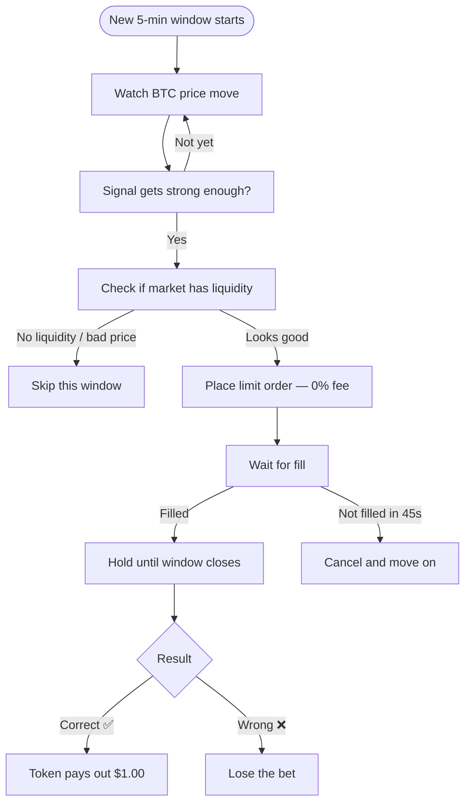

# polymarket-edge-research

> A live bot that trades Polymarket's 5-minute BTC prediction markets.


---

## What This Is

Every 5 minutes, Polymarket asks: **"Will BTC be higher or lower than 5 minutes ago?"**

This bot watches BTC's price move during each window, figures out which direction is winning, and places a bet just before the window closes — when the outcome is nearly certain.

---

## How It Works



---

## The Edge

The bot's main signal is simple: **how much has BTC moved since this window opened?**

A big move in one direction almost never reverses in the last 60 seconds. The bot bets with the trend.

The catch: when the signal is obvious, the market already knows — so the token costs more and your profit margin shrinks. The bot skips windows where the token is too expensive to be worth it.

**Fee structure:** The bot uses limit orders (0% fee) instead of market orders (7% fee). On a tight-margin trade, that difference is everything.

---

## Live Results

**Session: 2026-06-05 — 2 trades, 2 wins ✅**

Both trades were strong-signal windows where BTC moved clearly in one direction. The bot held through resolution and both paid out.

> Balance went from $24.81 → ~$25.95 across the two wins, then dropped to ~$19.85 due to a silent fill bug (see Known Issues below).

---

## Project Status

| Phase | Status |
|---|---|
| Signal engine + backtest | ✅ Done |
| Live snipe bot | ✅ Done |
| 0% fee limit orders | ✅ Done |
| **Live trading** | 🟢 Active |
| Silent fill bug fix | 🔄 In progress |
| Auto-claim + compounding | 📋 Planned |

---

## Known Issues

**Silent fill bug:** Occasionally the API reports that an order timed out — but it actually filled on-chain without the bot knowing. The bot can end up holding tokens it doesn't know about. Fix is in progress.

---

## Quick Start

```bash
git clone https://github.com/Suuuryaa/polymarket-edge-research
cd polymarket-edge-research
pip install -r requirements.txt

# Set up your Polymarket credentials
python setup_credentials.py

# Start the bot
python bot.py --mode safe --bankroll 20.00
```

---

## Files

```
bot.py                 Main bot — places and manages live trades
strategy.py            Signal engine — reads BTC price, decides direction
setup_credentials.py   One-command credential setup
backtest.py            Test the strategy on historical data
collect_data.py        Collects live BTC window data 24/7
```
