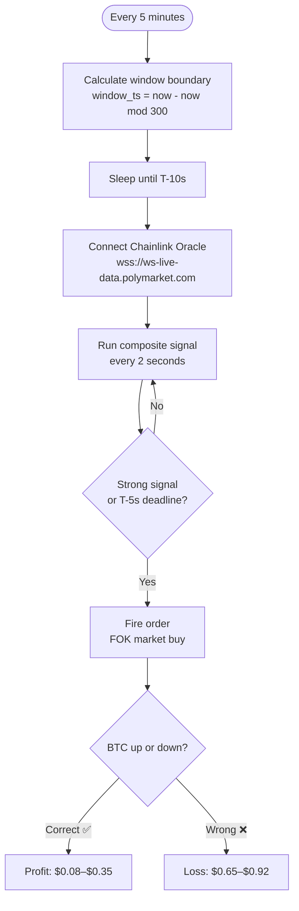

# polymarket-edge-research

> Building a profitable bot for Polymarket's 5-minute BTC Up/Down markets — with honest backtesting and real execution costs.


---

## What This Is

Every 5 minutes, Polymarket asks: **"Will BTC be higher or lower than it was 5 minutes ago?"**

Win → token pays $1.00. Lose → you lose your bet. Simple market. Hard to beat.

This project builds a bot that enters at **T-10 seconds** before each window closes — when direction is nearly locked in — and sizes bets based on realistic token pricing, not the fake $0.50 that makes paper bots look 2× better than they are.

---

## How It Works



---

## The Edge

The key insight most bots miss: **the signal and the token price are linked.**

When you're confident, so is the market. Expensive confidence = thin margin.

| Signal Strength | What BTC did | Token costs | You need to win |
|---|---|---|---|
| Flat | < 0.005% move | $0.50 | 50% |
| Weak | ~0.02% move | $0.55 | 55% |
| Moderate | ~0.05% move | $0.65 | 65% |
| Strong | ~0.10% move | $0.80 | 80% |
| Decisive | 0.15%+ move | $0.92 | 92% |

**The signal that matters:** `(current BTC price − window open) / window open`

At T-10s with a 0.10%+ move, price almost never reverses in 10 seconds. This one number — weighted 5–7× — dominates all 7 indicators combined.

---

## Backtest Results

> 7 days · 2,016 windows · real BTC/USD data

| Metric | Value |
|---|---|
| Win rate | **88.6%** |
| Break-even needed | 67.6% |
| EV per dollar risked | **+$0.21** ✅ |
| Avg token price | $0.676 |
| Execution cost | 32% of naive P&L |

**By signal strength:**

| Bucket | Win Rate | Token Price | Edge |
|---|---|---|---|
| Weak `< 0.02%` | 68.7% | $0.52 | ✅ Marginal |
| Moderate `0.02–0.05%` | 87.6% | $0.59 | ✅ Good |
| Strong `0.05–0.10%` | 96.2% | $0.72 | ✅ Strong |
| Decisive `> 0.10%` | 99.4% | $0.89 | ✅ High win, thin margin |

> ⚠️ Win rates are simulated with a calibrated reversal model. Real expected: **68–75%** based on community data. 30-day live collection running to validate.

---

## Project Status

| Phase | Status |
|---|---|
| Execution realism model | ✅ Done |
| Composite signal (7 indicators) | ✅ Done |
| Backtest engine + delta pricing | ✅ Done |
| Clock-based snipe bot | ✅ Done |
| Chainlink oracle WebSocket | ✅ Done |
| **30-day live data collection** | 🔄 Running now |
| Live dry-run validation | 📋 After day 30 |
| Auto-claim + live trading | 📋 Planned |

---

## Quick Start

```bash
git clone https://github.com/Suuuryaa/polymarket-edge-research
cd polymarket-edge-research
pip install -r requirements.txt

# Fetch BTC data
python chainlink_fetcher.py --days 7

# Run backtest
python backtest.py --compare

# Dry run — live data, no real money
python bot.py --dry-run --mode safe
```

Copy `.env.example` → `.env` for live trading credentials.

---

## Codebase

```
bot.py                 Main snipe bot (clock timing, 3 modes: safe / aggressive / degen)
strategy.py            Composite signal — window delta dominant
backtest.py            Backtest with realistic token pricing
chainlink_fetcher.py   BTC/USD 5-min data (Binance or on-chain Chainlink)
collect_data.py        24/7 live collector — one row per 5-min window
execution_realism.py   Slippage, quote freshness, adverse fill modeling
paper_trading.py       Paper simulator with naive vs realistic comparison
```
