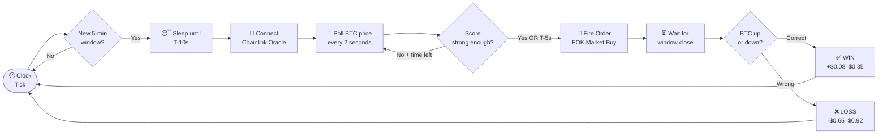
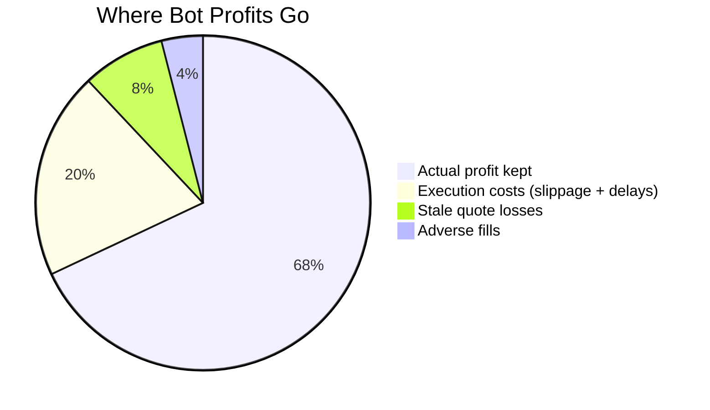
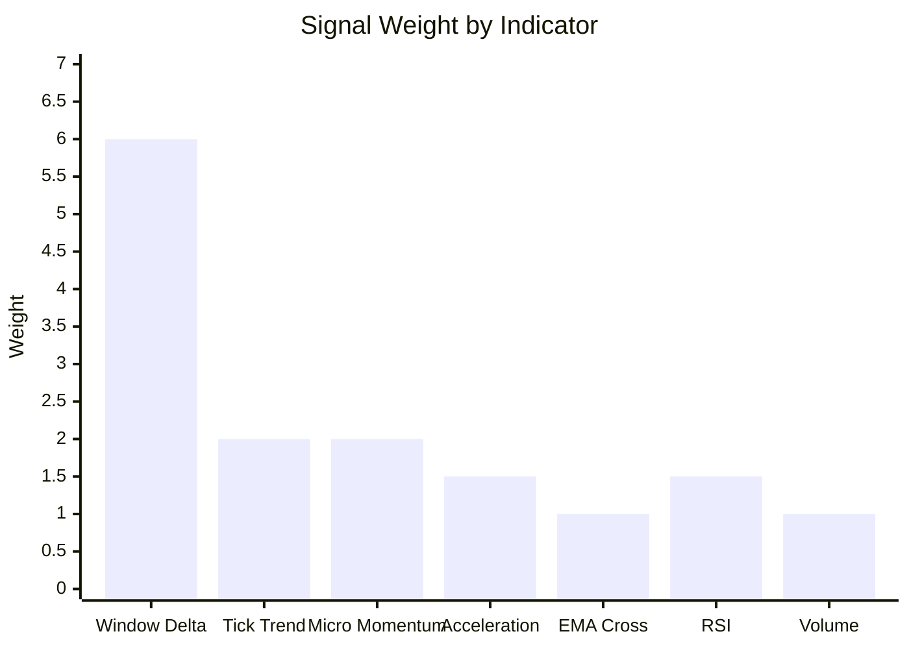
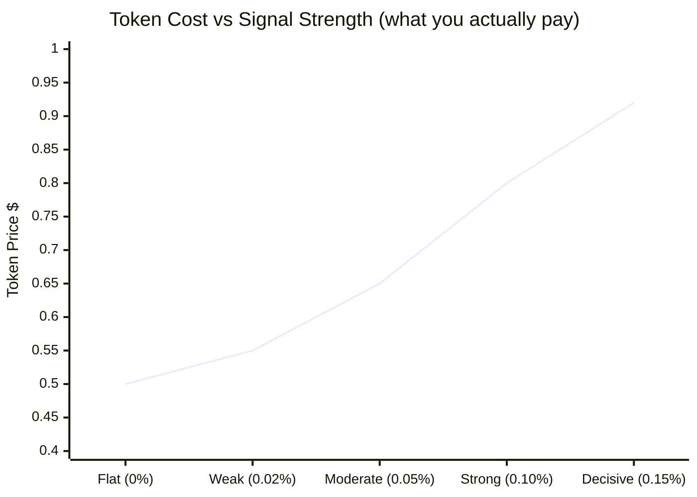
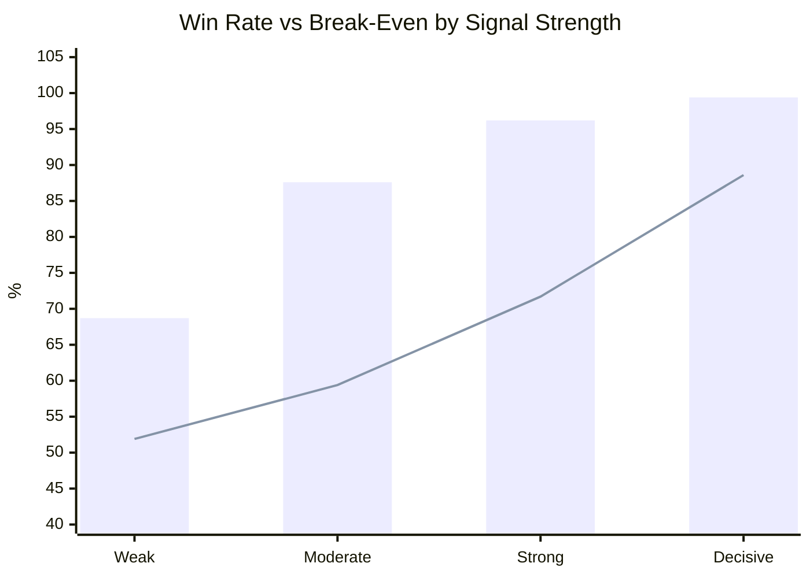
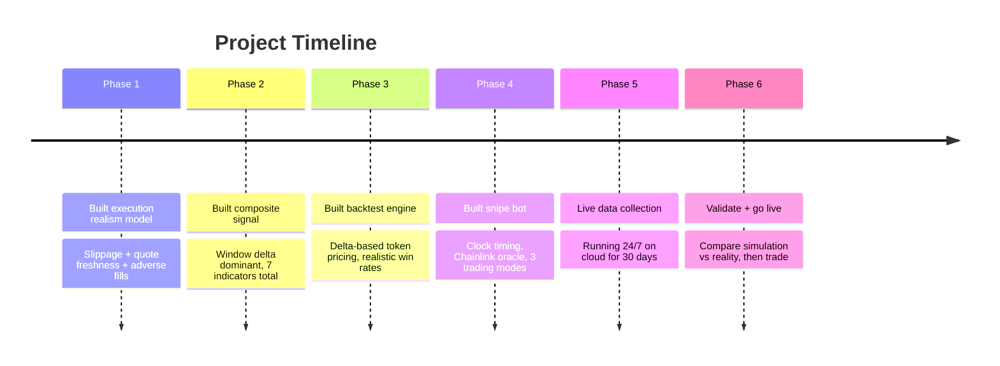

# polymarket-edge-research

> **Work in Progress** — Building a bot that trades Polymarket's 5-minute BTC prediction markets profitably.


---

## The Problem

Every 5 minutes, Polymarket opens a market with one question:

> **"Will BTC be higher or lower than it was 5 minutes ago?"**

If you're right, your token pays $1.00. If you're wrong, you lose what you paid. Sounds simple. But **92% of traders lose money** on these markets. Most bots look profitable in testing, then fail in real trading. This project figures out exactly why — and builds something that doesn't fail.

---

## How the Bot Works



---

## Why Most Bots Fail



**The 3 hidden killers:**
- 📉 **Wrong token price in backtests** — assume $0.50, reality is $0.70–$0.92
- 📊 **Wrong signal** — momentum has zero edge. Window delta is everything
- ⏱️ **250ms taker delay** — hardcoded by Polymarket on all BTC market orders

---

## The Signal: Window Delta Dominates



**Window Delta** = `(current BTC price − window open price) / window open price`

At T-10s, if BTC is already up 0.10% from the open — it almost never reverses in 10 seconds. This single number directly answers the market's question and gets weighted 3–4× more than everything else combined.

---

## Token Pricing Reality



Most backtests assume $0.50 per token — that's why they look 2× more profitable than reality. When the signal is clear, **market makers see it too** and price the token accordingly.

---

## Backtest Results (7 days, 2,016 windows)



> 🟦 Bar = actual win rate &nbsp;&nbsp; 🟧 Line = break-even win rate needed

Every bucket clears break-even. Strategy has **+$0.21 EV per dollar risked**.

---

## Current Status



---

## How to Run

```bash
git clone https://github.com/Suuuryaa/polymarket-edge-research
cd polymarket-edge-research
pip install -r requirements.txt

# Get BTC data
python chainlink_fetcher.py --days 7

# Run backtest
python backtest.py --compare

# Dry run — real data, no real money
python bot.py --dry-run --mode safe
```

Copy `.env.example` → `.env` and add your Polymarket credentials for live trading.

---

## Files

| File | What it does |
|---|---|
| `bot.py` | Main snipe bot — clock timing, signal, order execution |
| `strategy.py` | 7-indicator signal with window delta dominant |
| `backtest.py` | Replay historical data through the strategy |
| `chainlink_fetcher.py` | Fetch BTC/USD 5-min candles from Binance or on-chain |
| `collect_data.py` | Live data collector — runs 24/7, one row per 5 minutes |
| `execution_realism.py` | Models real fill costs: slippage, staleness, adverse fills |
| `paper_trading.py` | Paper trading simulator |
