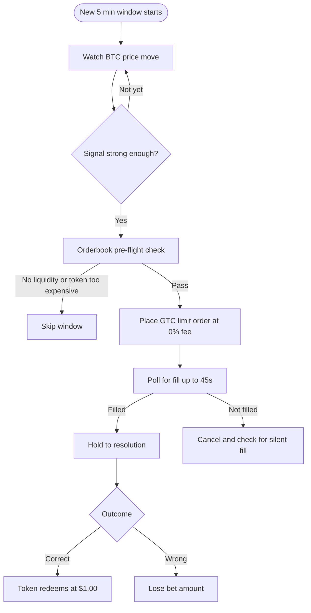

# Polymarket Trading Bot

> A bot that trades Polymarket's 5 minute BTC Up/Down prediction markets using momentum signals and zero fee limit orders.


> **Disclaimer:** This is an experimental trading bot. Prediction markets carry real financial risk. You can lose your entire balance. Only use money you can afford to lose. This project is for educational and research purposes.

## What This Does

Every 5 minutes, Polymarket asks: **"Will BTC be higher or lower than 5 minutes ago?"**

This bot watches how much BTC has moved during a window, detects the dominant direction, and enters a trade just before close when the outcome is nearly locked in. It uses limit orders to avoid the 7% taker fee, checks liquidity before every trade, and skips windows where the edge is not there.

## How It Works



## Trading Strategy

The dominant signal is simple: **how far has BTC moved since this window opened?**

A strong move in one direction almost never reverses in the final 60 seconds. The bot bets with the trend and skips windows where the signal is weak or the token price is too expensive to be worth it.

Seven indicators feed into the signal: window delta, momentum, acceleration, EMA crossover, RSI, volume surge, and tick trend. Window delta is weighted far more than all others combined.

## Risk Management

- Hard stop if balance drops below $15
- Skips any window where token price exceeds $0.92
- Skips if orderbook liquidity is less than 2x the bet size
- Bets capped at 80% of on-chain balance
- Detects silent fills and handles them correctly

## Security

- **Never upload your `.env` file, private keys, or API credentials to GitHub**
- Use a separate wallet with only the funds you intend to trade
- You are responsible for complying with Polymarket's Terms of Service and the laws in your country

## Installation

```bash
git clone https://github.com/Suuuryaa/polymarket-edge-research
cd polymarket-edge-research
pip install -r requirements.txt
python setup_credentials.py
```

`setup_credentials.py` walks you through entering your Polymarket API keys interactively and saves them to `.env`.

## Usage

```bash
# Live trading
python bot.py --mode safe --bankroll 20.00

# Dry run (no real money)
python bot.py --mode safe --bankroll 20.00 --dry-run

# Check logs
tail -f /tmp/bot_live.log
```

**Modes:**

| Mode | Risk level | Description |
|---|---|---|
| `safe` | Low | 25% of bankroll per trade |
| `aggressive` | Medium | Larger bets, lower signal bar |
| `degen` | High | Trades every window regardless of signal |

## Project Structure

```
bot.py                 Main bot
strategy.py            Signal engine
setup_credentials.py   Credential setup
backtest.py            Backtest on historical data
collect_data.py        Live data collector
```

## Roadmap

- [x] Signal engine and backtest
- [x] Live snipe bot with GTC limit orders
- [x] Silent fill detection
- [ ] Auto-claim winning tokens
- [ ] Compounding bankroll management

## License

MIT
