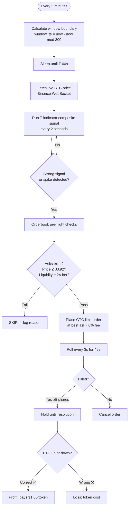

# polymarket-edge-research

> A live snipe bot for Polymarket's 5-minute BTC Up/Down markets — with honest backtesting and real execution costs.


---

## What This Is

Every 5 minutes, Polymarket asks: **"Will BTC be higher or lower than it was 5 minutes ago?"**

Win → token pays $1.00. Lose → you lose your bet. Simple market. Hard to beat.

This bot enters at **T-60 seconds** before each window closes — early enough to catch liquidity before it disappears — and places **GTC limit orders at the best ask** to pay 0% maker fee instead of the 7% taker fee.

---

## How It Works



---

## The Edge

The key insight most bots miss: **the signal and the token price are linked.**

When you're confident, so is the market. Expensive confidence = thin margin.

| Signal Strength | What BTC did | Token costs | You need to win |
|---|---|---|---|
| Flat | < 0.005% move | $0.50 | 50% |
| Weak | ~0.02% move | $0.55 | 55% |
| Moderate | ~0.05% move | $0.65 | 65% |
| Strong | ~0.10% move | $0.80 | 80% |
| Decisive | 0.15%+ move | $0.92 | 92% |

**The signal that matters:** `(current BTC price − window open) / window open`

At T-60s with a 0.10%+ move, price almost never reverses. This single number — weighted 5–7× — dominates all 7 indicators combined.

**Fee structure matters:** GTC limit orders = 0% maker fee. Market orders = 7% taker fee. At a $0.80 token, 7% fee kills the edge entirely.

---

## Live Results

| Date | Trade | Delta | Token Price | Result |
|---|---|---|---|---|
| 2026-06-05 06:35 UTC | BUY YES | +0.16% | $0.922 | ✅ Win |
| 2026-06-05 07:05 UTC | BUY NO | −0.20% | $0.960 | ✅ Win |

> Session record: **2/2 wins**. Started with $24.81, balance ~$19.85 after a silent fill bug (see Known Issues).

---

## Bot Settings

| Setting | Value | Why |
|---|---|---|
| Entry time | T-60s | Liquidity vanishes at T-10s on strong moves |
| Order type | GTC limit at best ask | 0% maker fee vs 7% taker |
| Fill window | 45s polling, cancel if unfilled | Avoid stale fills |
| Max token price | $0.92 | Above this, margin is too thin |
| Min partial fill | 5 shares | Accept partial fills |
| Stop threshold | $15 balance | Hard floor |

---

## Backtest Results

> 7 days · 2,016 windows · real BTC/USD data

| Metric | Value |
|---|---|
| Win rate | **88.6%** |
| Break-even needed | 67.6% |
| EV per dollar risked | **+$0.21** ✅ |
| Avg token price | $0.676 |
| Execution cost | 32% of naive P&L |

**By signal strength:**

| Bucket | Win Rate | Token Price | Edge |
|---|---|---|---|
| Weak `< 0.02%` | 68.7% | $0.52 | ✅ Marginal |
| Moderate `0.02–0.05%` | 87.6% | $0.59 | ✅ Good |
| Strong `0.05–0.10%` | 96.2% | $0.72 | ✅ Strong |
| Decisive `> 0.10%` | 99.4% | $0.89 | ✅ High win, thin margin |

> ⚠️ Win rates are simulated with a calibrated reversal model. Real expected: **68–75%** based on community data.

---

## Project Status

| Phase | Status |
|---|---|
| Execution realism model | ✅ Done |
| Composite signal (7 indicators) | ✅ Done |
| Backtest engine + delta pricing | ✅ Done |
| Clock-based snipe bot | ✅ Done |
| GTC limit orders (0% fee) | ✅ Done |
| Orderbook pre-flight checks | ✅ Done |
| **Live trading** | 🟢 Active |
| Silent fill bug fix | 🔄 In progress |
| Auto-claim + compounding | 📋 Planned |

---

## Known Issues

**Silent timeout bug:** Sometimes the API reports a timeout but the order actually filled on-chain. The bot currently doesn't detect this — it checks balance after every timeout but doesn't reconcile the difference automatically. Workaround: check balance manually after any timeout in the logs.

---

## Quick Start

```bash
git clone https://github.com/Suuuryaa/polymarket-edge-research
cd polymarket-edge-research
pip install -r requirements.txt

# Set up credentials (interactive)
python setup_credentials.py

# Start live bot
python bot.py --mode safe --bankroll 20.00

# Check logs
tail -f /tmp/bot_live.log
```

Copy `.env.example` → `.env` and fill in your Polymarket API credentials.

---

## Codebase

```
bot.py                 Main snipe bot (GTC limit orders, 3 modes: safe / aggressive / degen)
strategy.py            7-indicator composite signal — window delta dominant
backtest.py            Backtest with realistic token pricing
setup_credentials.py   One-command credential setup
collect_data.py        24/7 live data collector — one row per 5-min window
chainlink_fetcher.py   BTC/USD 5-min data (Binance)
execution_realism.py   Slippage, quote freshness, adverse fill modeling
paper_trading.py       Paper simulator with naive vs realistic comparison
```
